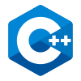
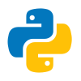

# Hello, World! 🌎 I'm Nicole 👋

## I'm a Cybersecurity and Threat Management student!

- 👩‍💻 I’m currently looking for **Summer 2026 Work Term opportunities**
- 🔭 I’m looking forward to building web and cloud security projects
- 🌱 I'm currently taking the following courses:
    - Project Management
    - Authentication & Access Control
    - IT Security Capstone Project
    - Mobile Application Security Assessment
    - IT Security Forensics
    - Threat Investigation
- 👯 I’m looking to collaborate on building security projects
- 🥅 2026 Goals: Expanding my knowledge, projects, certificates, and an internship!
- 😄 Pronouns: she/her
- ⚡ Fun fact: I sing, dance, and create art. I also love listening to K-POP!

### Connect with me:

&nbsp;&nbsp;

&nbsp;&nbsp;

&nbsp;&nbsp;

### Languages and Tools:

   &nbsp;&nbsp;
   &nbsp;&nbsp;
   &nbsp;&nbsp;
   &nbsp;&nbsp;
   &nbsp;&nbsp;
   &nbsp;&nbsp;
   &nbsp;&nbsp;
   &nbsp;&nbsp;
   &nbsp;&nbsp;
   &nbsp;&nbsp;
   &nbsp;&nbsp;
   &nbsp;&nbsp;
   
   &nbsp;&nbsp;
   &nbsp;&nbsp;
   &nbsp;&nbsp;
   &nbsp;&nbsp;
   &nbsp;&nbsp;
   &nbsp;&nbsp;
   &nbsp;&nbsp;
   &nbsp;&nbsp;
   &nbsp;&nbsp;
   &nbsp;&nbsp;
   &nbsp;&nbsp;
  

